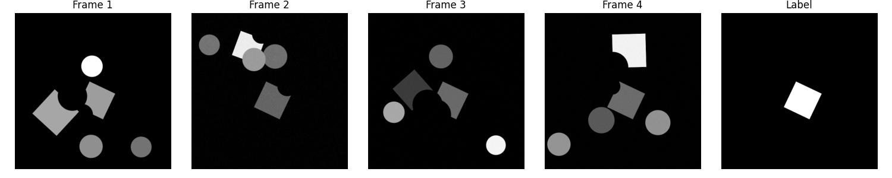

# SVSUNET — Sequence-to-Segmentation U-Net

> **Research software** — Embedded Systems & Instrumentation Department, ESIGELEC, France.  
> Redistribution is forbidden under any circumstances.

A PyTorch implementation of **SVSUNET**, a hybrid 3D/2D U-Net architecture for binary segmentation from sequences of 4 consecutive grayscale frames. The model learns to identify a target structure (e.g. a partially occluded square) across temporal context, outputting a single-channel segmentation mask.

---

## Table of Contents

- [Overview](#overview)
- [Architecture](#architecture)
- [Dataset](#dataset)
  - [Generating Synthetic Data (MATLAB)](#generating-synthetic-data-matlab)
  - [Directory Structure](#directory-structure)
  - [File Naming Convention](#file-naming-convention)
- [Installation](#installation)
- [Usage](#usage)
  - [Training](#training)
  - [Testing](#testing)
- [Configuration](#configuration)
- [Known Issues & Code Notes](#known-issues--code-notes)

---

## Overview

The task is to segment a specific square object from a scene where it may be partially occluded by circular or rectangular masks. Each sample consists of **4 frames** showing the scene from different viewpoints or time steps, each with different occlusion patterns. The model must fuse temporal information to produce a single segmentation label.

| Input | Output |
|-------|--------|
| 4 × grayscale frames `(1, 4, H, W)` | Binary mask `(1, H, W)` |



---

## Architecture

SVSUNET is UNNET encoder–decoder:

- **Encoder**: 7 stacked `ENCODERBLOCK` modules. Each block applies 3D convolutions across the temporal dimension, followed by a `FeatureFusionOperation` that collapses the frame axis into a 2D skip connection via a `Conv3d(kernel=(T,1,1))` and bilinear interpolation.
- **Decoder**: 6 stacked `DECODERBLOCK` modules. Each block upsamples, then fuses the 2D skip connection using a `ChannelAttentionBlock` (global average pooling → channel-wise sigmoid gating), followed by a residual 2D conv block.
- **Output**: A `Conv2DOutput` layer produces a single-channel sigmoid map.

```
Input (B, 1, 4, 512, 512)
     │
  ENCODER ×7   [3D convolutions, temporal fusion → 2D skip connections]
     │
  BOTTLENECK
     │
  DECODER ×6   [2D upsample + channel attention skip fusion]
     │
Output (B, 1, 512, 512)
```

The loss function is the **Dice loss**:

```
L = 1 − (2 · Σ(pred · target) + 1) / (Σ(pred + target) + 1)
```

---

## Dataset

### Generating Synthetic Data (MATLAB)

The synthetic dataset is generated by `HybridUnetDataset.m`. Each sample contains:

- A **target square** (the object to segment), with a random occlusion (circle or rectangle) covering part of it — position, size, and color vary per frame.
- 4 additional **distractor squares**, each with their own random occlusion.
- Up to 3 **distractor circles** placed randomly.

The MATLAB script validates each sample by checking that the grayscale image has exactly `maxNumCircles + 2` connected components (4-connectivity). Samples that fail this check are discarded and regenerated.

**Parameters to configure in `HybridUnetDataset.m`:**

| Variable | Default | Description |
|---|---|---|
| `d` | `512` | Image size (pixels, square) |
| `numImages` | `20` | Number of valid samples to generate |
| `numSquares` | `5` | Total squares per frame (1 target + 4 distractors) |
| `maxNumCircles` | `3` | Number of distractor circles |
| `file_path` | `./dataset/test` | Output directory (`train` or `test`) |

Run the script twice — once with `file_path = "./dataset/train"` and once with `./dataset/test` — to produce both splits.

### Directory Structure

```
dataset/
├── train/
│   ├── images/
│   │   ├── image_001_frame_001.png
│   │   ├── image_001_frame_002.png
│   │   ├── image_001_frame_003.png
│   │   ├── image_001_frame_004.png
│   │   ├── image_002_frame_001.png
│   │   └── ...
│   └── labels/
│       ├── label_001.png
│       ├── label_002.png
│       └── ...
└── test/
    ├── images/
    └── labels/
```

### File Naming Convention

Images: `image_<SAMPLE_ID>_frame_<FRAME_NUM>.png`  
Labels: `label_<SAMPLE_ID>.png`

- `SAMPLE_ID` — zero-padded 3-digit integer (e.g. `001`, `042`)
- `FRAME_NUM` — 1-indexed frame number (`001`–`004`)
- Each sample has exactly 4 frames and 1 label

The `FramePictures` dataset class parses these names automatically. A **sliding window** is used so that if a sample has more than 4 frames, multiple overlapping sequences of 4 are created.

---

## Installation

```bash
pip install torch torchvision opencv-python numpy matplotlib
```

MATLAB R2021a or later is required to run `HybridUnetDataset.m` (uses `insertShape` from the Computer Vision Toolbox).

---

## Usage

### Training

```bash
python main.py \
  -job TRAIN \
  -data_path ./dataset/train \
  -test_path  ./dataset/test \
  -model_file ./weights/model.pth \
  -log_file   ./logs/training.csv \
  -num_epoch  200
```

To resume from a checkpoint:

```bash
python main.py \
  -job TRAIN \
  -data_path  ./dataset/train \
  -test_path  ./dataset/test \
  -model_file ./weights/model.pth \
  -log_file   ./logs/training.csv \
  -num_epoch  400 \
  -state_file ./weights/model_00100.pth
```

### Testing

```bash
python main.py \
  -job TEST \
  -test_path    ./dataset/test \
  -model_file   ./weights/model.pth \
  -results_path ./results
```

Results are saved as PNG files in `results_path`, each showing the 4 input frames, the ground-truth label, and the model prediction side by side. A `loss.csv` summary is also written.

### All CLI Arguments

| Argument | Required for | Description |
|---|---|---|
| `-job` | Both | `TRAIN` or `TEST` |
| `-data_path` | Train | Training dataset directory |
| `-test_path` | Both | Test/validation dataset directory |
| `-model_file` | Both | Path to save/load model weights (`.pth`) |
| `-log_file` | Train | Path to CSV training log |
| `-num_epoch` | Train | Total number of epochs |
| `-state_file` | Train (optional) | Checkpoint to resume from |
| `-results_path` | Test | Directory for output prediction images |
| `-nfold` | Both (optional) | Cross-validation fold index |

---

## Configuration

The following hyperparameters are set at the top of `main.py`:

| Variable | Default | Description |
|---|---|---|
| `num_batch` | `10` | Batch size |
| `num_workers` | `4` | DataLoader worker threads |
| `learning_rate` | `1e-3` | Initial learning rate |
| `min_learning_rate` | `1e-5` | Floor for LR scheduler |
| `nfilter` | `64` | Base filter count (model is instantiated with `nfilter=8`) |
| `augment_noise` | `0.025` | Gaussian noise σ ceiling for training augmentation |
| `save_frequency` | `10` | Save a checkpoint every N epochs |
| `load_first` | `False` | Preload all data into RAM |

> **Note:** `nfilter=64` in the config comment but the model is created with `nfilter=8`. With `nfilter=8` the encoder channels are `8→16→32→64→128→256→512`. Change this value in the `SVSUNET(in_c=1, nfilter=8)` calls inside `train()` and `test()` if you want a larger model.

**Data augmentation** (applied only during training when `noise` is set):
- **Horizontal flip** with 50% probability — applied identically to all frames in a sequence and to the label.
- **Additive Gaussian noise** with σ ~ Uniform(0, `augment_noise`) — applied to frames only.

---

## Known Issues & Code Notes

A few things worth knowing if you are reading or extending this code:

- **`from model import *` is duplicated** in `main.py` (line 4 and 5). The second import is harmless but should be removed.

- **`args.num_epochs` typo in log writing** — the `train()` function uses `args.num_epoch` everywhere except the log-writing block which calls `args.num_epochs` (with an `s`). This will raise an `AttributeError` if `-log_file` is provided. Fix: replace `args.num_epochs` with `args.num_epoch` in that block.

- **`train_mse` is tracked in history but never computed** — `history['train_mse']` is populated in the log but the training loop never accumulates it. The key exists but is always empty.

- **Indentation bug in `_group_by_sample`** (`data.py`, line ~53) — `groups[sample_id].sort(...)` is indented inside the `if sample_id not in groups` block, meaning it only runs when the key is *first* created. Move it one level out so it sorts after all frames for a sample are collected.

- **`FeatureFusionOperation` comment** — the comment `#FAZ NADA ÇA MERDA?` (roughly "does this do anything?") is a debug note; the operation does apply a learned `Conv3d(kernel=(T,1,1))` to collapse the frame dimension, which is intentional.

- **Hardcoded image size** — the decoder block sizes (`512, 256, 128, ...`) and the `ChannelAttentionBlock` size parameters are hardcoded for 512×512 inputs. If you change the input resolution you must update these values in `SVSUNET.__init__`.
